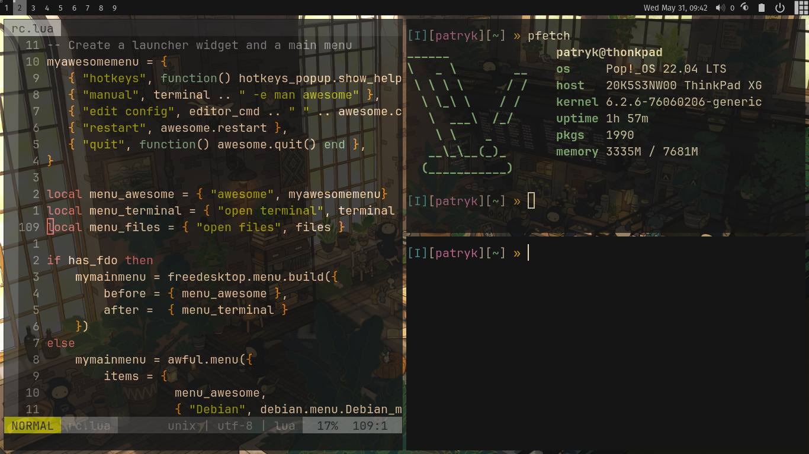

# Dotfiles 
**:bear: Pliki konfiguracyjne dla :**
* emacs
* nvim
* i3-gaps
  - i3blocks
  - rofi
  - dunst
* ~~spectrwm~~
* AwesomeWM
  - picom
  - rofi
  - widgets
* reszta
  - zshrc
  - zshtheme
***
### Awesome WM (Pop!_OS)

***
### i3-gaps (Arch Labs)

***
### Spectrwm (Debian Buster)

